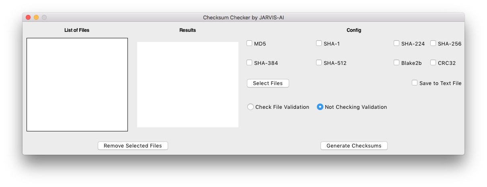
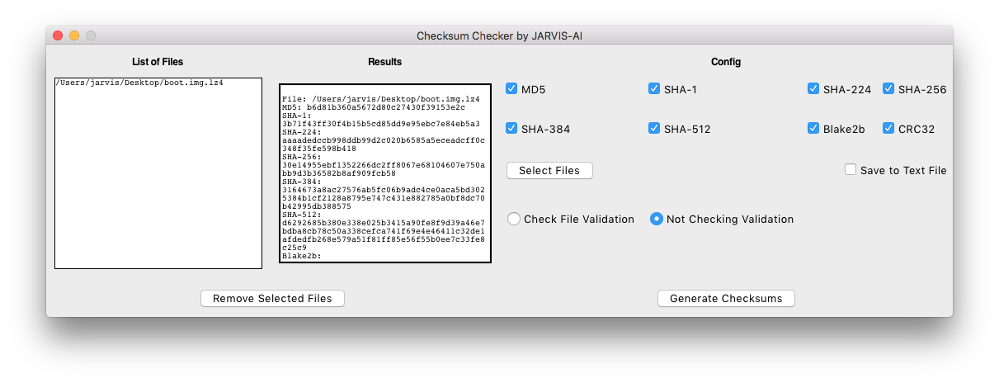
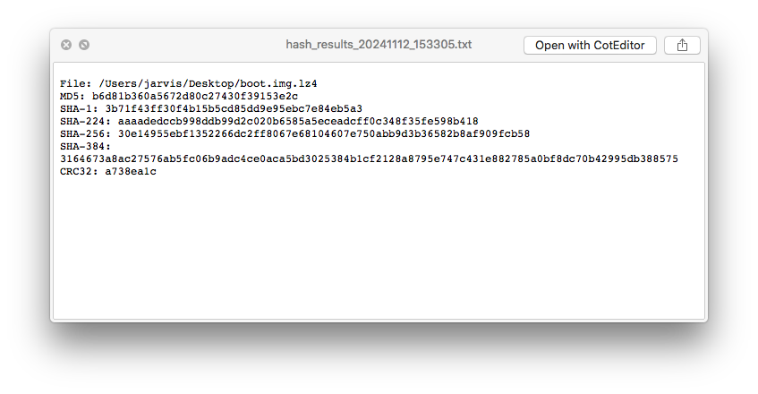
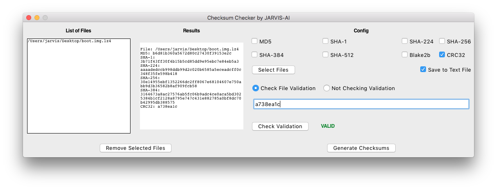
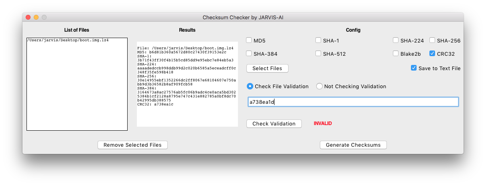
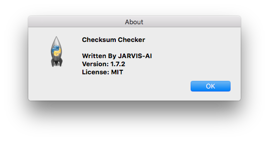

# Checksum Verifier by JARVIS-AI

**Version**: 1.7.2

A Python application built with Tkinter that calculates multiple hash checksums (CRC, MD5, SHA-1, SHA-256) for input files. This app allows users to verify file integrity by choosing specific algorithms to check and supports outputting results within the app or saving them to a text file.

---

## Features

- **Multiple Checksum Algorithms**: Calculate CRC, MD5, SHA-1, and SHA-256 hashes for any input file.
- **User-Friendly Interface**: Simple Tkinter-based GUI for easy selection of files and hash options.
- **Flexible Output Options**: Choose to view the results directly in the app or save them as a text file for later reference.
- **Customizable Checks**: Users can select which hash algorithms to check, making it versatile for different use cases.

---

## Installation

1. **Clone the repository**:
   ```bash
   git clone https://github.com/username/checksum-verifier.git
   cd checksum-verifier
   ```

2. **Install Dependencies**:
   Ensure you have Python 3 installed, then install Tkinter if it's not pre-installed:
   ```bash
   pip install tkinter
   ```

---

## Usage

1. **Run the App**:
   ```bash
   python checksum_verifier.py
   ```

2. **Select File**: Use the file selection dialog to choose the file you want to verify.

3. **Choose Algorithms**: Check the boxes for the checksum algorithms you wish to use.

4. **View Results**: Results will be displayed in the app, or choose the option to save the results to a text file.

---

## Screenshots



<hr />

 

<hr />



<hr />



<hr />



<hr />



---

## Contributing

Feel free to submit pull requests to add features, improve the UI, or fix bugs. Open issues to discuss any changes or suggestions.

---

## License

This project is licensed under the MIT License.

---

## Contact

For any questions, reach out to [your email or GitHub profile].

---

Let me know if you'd like more details or specific customizations!